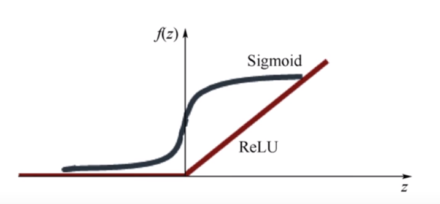

# XSigmoid 보다 ReLU가 더 좋아

ReLU : Rectified Linear Unit

> z < 0 => *0*
>
> z >= 0 => *비례함수*

**마지막 layer는 sigmoid 사용**

---

# Weight 초기화 잘해보자

> 초기값 0 이면, chain rule을 적용하면 다 0이된다.
>
> => **0** 으로 초기화 하면 안된다!

> RBM : Restricted Boltzmann Machine
>
> RBM을 사용한 네트워크 : Deep Belief Nets
>
> "Forward로 계산한 X의 값과 Backward로 계산한 X의 값의 차가 최소가 되도록 Weight를 조절"

#### Xavier initialization

input(fan_in)과 output(fan_out)의 수에 맞게 초기값을 설정한다.

~~~ 
W = np.random.randn(fan_in, fan_out) / np.sqrt(fan_in)
W = np.random.randn(fan_in, fan_out) / np.sqrt(fan_in / 2)
~~~

---

# NN dropout and model ensemble

> Overfitting 인가? 
>
> > training dataset의 정확도가 약 0.99에 근접하지만
> >
> > test dataset의 정확도가 낮을때 Overfitting일 가능성이 높다.

=> 해결 방법

1. Training data 수 늘리기

2. Featrues의 수 줄이기

3. **Regularization**

   ​

#### Dropout

"랜덤하게 몇몇의 뉴런들을 축소시키자!"

~~~
dropout_rate = tf.placeholder("float") #일반적으로 0.5로한다.
_L1 = tf.nn.relu(tf.add(tf.matmul(X, W1), B1))
L1 = tf.nn.dropout(_L1, dropout_rate)
~~~

**학습할때만 dropout을 사용, 평가할 때는 dropout_rate 1로 설정**

#### Ensemble

"독립된 여러개의 Model을 만들고 합친다."

---

# NN LEGO play

1. **Fast forward**  :  몇 단계 뛰고 진행하기
2. **Split & merge**
3. **Recurrent network** : 옆으로 network 구성하기 => *RNN*

---

