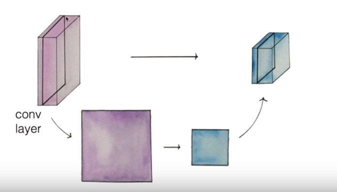
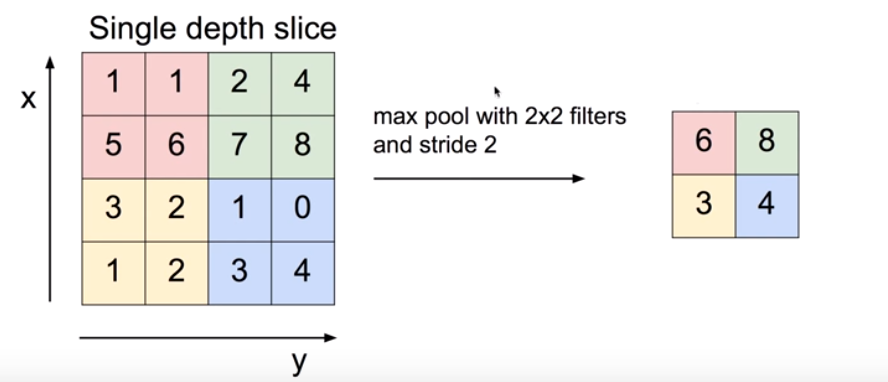

# ConvNet의 Conv레이어 만들기

기본적인 아이디어 : 고양이 실험

### Strat with an image

- 이미지 : **width * height * depth**

- 이미지의 일부분만 처리 : filter => 크기는 지정 가능 

    -> One Number **ReLU(Wx + b)**

- 똑같은 filter를 가지고 전체의 이미지를 본다!

- 7 * 7 input, 3 * 3 filter, stride = 1 ==> 5 * 5 output

- 7 * 7 input, 3 * 3 filter, stride = 2 ==> 3 * 3 output

- **(N - F) / stride + 1 **

- **zero pad** : 테두리에 0을 표시

  - 모서리임을 알려줌
  - image의 크기가 작아지는 것을 해결
  - 7 * 7 input -> 9 * 9 input,  3 * 3 filter, stride = 1 => 7 * 7 output

### Swiping the entire image

- filter를 여러개 만든다.
- 각각의 filter는 서로 다른 Weight값을 갖는다.
- Activation Map은 (output width, output height, #filters)

---

# ConvNet Max pooling과 Full Network

### pooling

- **sampling**
- 이미지 resize : 크기가 작아진다.

### MAX POOLING

- 전체의 값 중에 가장 큰 값을 뽑는다.

---

# ConvNet의 활용 예

- LeNet-5
- AlexNet
- GoogLeNet : Inception module
- ResNet
- Sentence Classification
- AlphaGo

---